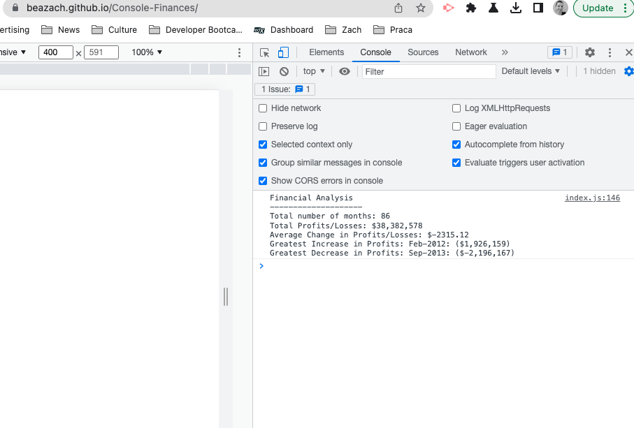

# Console-Finances
Deployed link: https://beazach.github.io/Console-Finances/

## Description 
In this project I was tasked with creating code for analyzing the financial records of a company, based on the provided financial dataset including profit/losses over months.

### Solution
I've looped through the data set to calculate profits/losses over the entire period, changes from month to month, average changes over the period and the greatest decrease and increase in profits/losses. 

### Challenges
One of the main challenges was accounting for the lack of p/l changes in month 1, which affected calculations of the average changes over the entire period.

## Usage
The code prints the analysis to the console.

## Contact Details
Please leave a note or get in touch about suggestions for code improvements, future projects and collaborations.

## License 
MIT

## Resources 
https://fantastic-pudding.vercel.app/02-css-module/activities/day-04/challenge/ (accessed 8 January 2023)